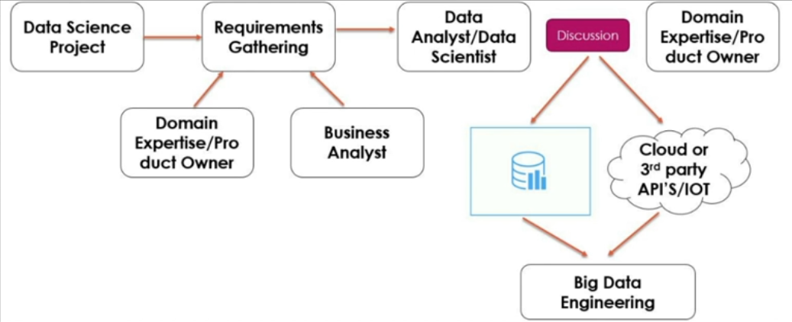
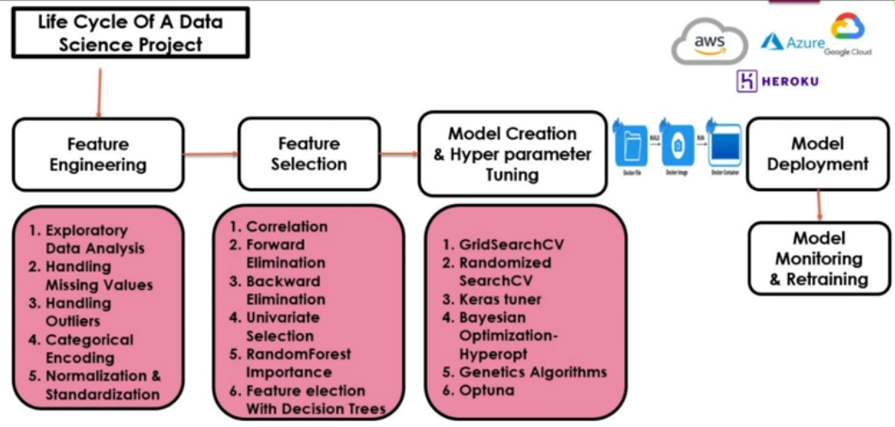

## **Apache Airflow**

<div align="center"></div>
<br>

Apache Airflow is an open-source platform used to programmatically author, schedule, and monitor workflows. It allows you to define complex workflows as code and manage their execution. Airflow is commonly used for data pipelines, where tasks like data extraction, transformation, and loading (ETL) are orchestrated across multiple systems.




---
### **Why Airflow For MLOps**

In MLOps (Machine Learning Operations), orchestrating ML workflows efficiently is crucial for ensuring that data pipelines, model training, and deployment tasks happen smoothly and in an automated manner. Airflow is well-suited for this purpose because it allows you to define, automate, and monitor every step in an ML pipeline.

#### **Features of Airflow in MLOps**

1. **Orchestrating ML Pipelines and ETL Pipelines**  
   Airflow facilitates the seamless orchestration of complex ML and ETL workflows by enabling users to define dependencies and schedule tasks effectively.

2. **Task Automation**  
   Automate repetitive tasks such as data preprocessing, model training, and evaluation with minimal manual intervention.

3. **Monitoring and Alerts**  
   Airflow provides tools to ensure smooth pipeline execution:  
   - **Real-Time Monitoring**: View workflow status and performance through the Airflow UI.  
   - **Task Logs**: Access detailed logs for debugging and analysis.  
   - **Alerts and Notifications**: Receive email alerts for failures or task completion.  
   - **Retry Mechanism**: Automatically retry failed tasks based on pre-defined rules.

Airflow’s flexibility, scalability, and robust monitoring capabilities make it a powerful choice for managing MLOps workflows effectively.


## Key Components in Apache Airflow

### 1. DAG (Directed Acyclic Graph)
- **Definition**: A collection of tasks that you want to schedule and run, organized in a directed graph.
- **Characteristics**:
  - **Directed**: Tasks must follow a specific sequence.
  - **Acyclic**: No task should depend on itself.
- **Example**:
  ```
  A → B → C
  ```
  Task A must complete before Task B, and Task B must complete before Task C.

### 2. Tasks
- **Definition**: Individual units of work within a DAG.
- **Examples**:
  - Executing a Python function.
  - Querying a database.
  - Sending an HTTP request.

### 3. Dependencies
- **Definition**: Relationships between tasks where one task must complete before another can start.
- **Purpose**: Controls the execution order of tasks.
- **Mechanisms**:
  - `set_upstream()`: Defines a task that must run before the current task.
  - `set_downstream()`: Defines a task that must run after the current task.
- **Example**:
  ```
  Task A >> Task B  # Task A is upstream of Task B
  Task B << Task C  # Task C is downstream of Task B
  ```

## Why Apache Airflow for MLOps

In **MLOps (Machine Learning Operations)**, orchestrating machine learning workflows efficiently is critical to ensure that data pipelines, model training, and deployment tasks are executed smoothly and automatically. Apache Airflow is well-suited for MLOps due to its ability to **define, automate, and monitor** every step in an ML pipeline.

### 1. Orchestrating ML Pipelines and ETL Pipelines
- **Definition**: Airflow uses **DAGs (Directed Acyclic Graphs)** to organize tasks and their dependencies, enabling the creation of structured ML and ETL (Extract, Transform, Load) pipelines.
- **Workflow Example**:
  ```
  Data Ingestion → Data Preprocessing → Model Training and Evaluation → Model Deployment
  ```
- **How It Works**:
  - Tasks are defined within a DAG.
  - Dependencies ensure tasks execute in the correct order (e.g., preprocessing completes before training).

### 2. Task Automation
- Airflow automates repetitive tasks in the ML pipeline, reducing manual intervention.
- Examples include scheduling data ingestion, triggering model retraining, or automating deployment processes.

### 3. Monitoring and Alerts
Airflow provides robust tools for monitoring and managing ML workflows:
- **Real-Time Monitoring**:
  - The **Airflow UI** offers a visual interface to track task progress and pipeline status.
- **Task Logs**:
  - Detailed logs for each task to diagnose issues or verify execution.
- **Alerts and Notifications**:
  - Configurable alerts (e.g., email notifications) for task failures or completions.
- **Retry Mechanism**:
  - Automatically retries failed tasks based on predefined rules, improving pipeline reliability.