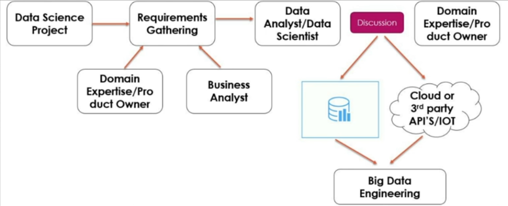
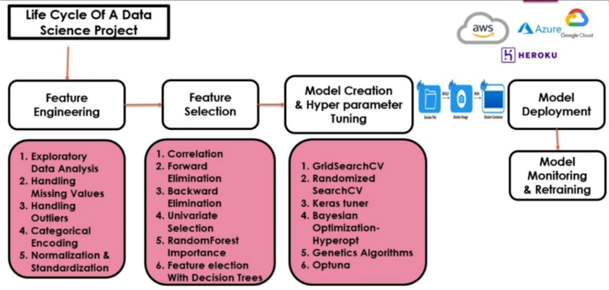

## **Apache Airflow**

 

---
### **Why Airflow For MLOps**

In MLOps (Machine Learning Operations), orchestrating ML workflows efficiently is crucial for ensuring that data pipelines, model training, and deployment tasks happen smoothly and in an automated manner. Airflow is well-suited for this purpose because it allows you to define, automate, and monitor every step in an ML pipeline.

#### **Features of Airflow in MLOps**

1. **Orchestrating ML Pipelines and ETL Pipelines**  
   Airflow facilitates the seamless orchestration of complex ML and ETL workflows by enabling users to define dependencies and schedule tasks effectively.

2. **Task Automation**  
   Automate repetitive tasks such as data preprocessing, model training, and evaluation with minimal manual intervention.

3. **Monitoring and Alerts**  
   Airflow provides tools to ensure smooth pipeline execution:  
   - **Real-Time Monitoring**: View workflow status and performance through the Airflow UI.  
   - **Task Logs**: Access detailed logs for debugging and analysis.  
   - **Alerts and Notifications**: Receive email alerts for failures or task completion.  
   - **Retry Mechanism**: Automatically retry failed tasks based on pre-defined rules.

Airflow’s flexibility, scalability, and robust monitoring capabilities make it a powerful choice for managing MLOps workflows effectively.
