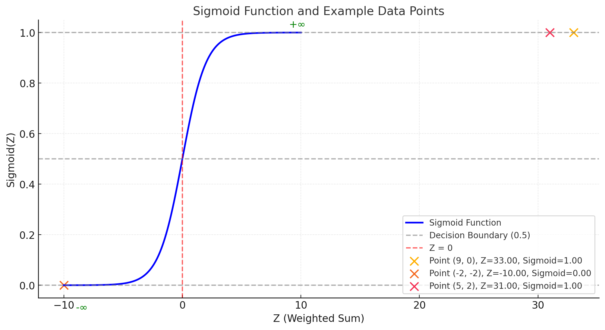

## **Fundamentals of Logistic Regression**

### **1. How to Determine if a Point Lies on a Line**
**Problem Statement**
- Given a line equation in the form:
  $A  x + B y + C = 0$
- We want to check whether a specific point $(x_1, y_1)$ lies **on the line**, in the **positive region**, or in the **negative region**.

**Steps to Solve**
1. Substitute the point $(x_1, y_1)$ into the line equation:
   $A  x_1 + B  y_1 + C$
2. Interpret the result:
   - If $= 0$: The point lies **on the line**.
   - If $> 0$: The point lies in the **positive region**.
   - If $< 0$: The point lies in the **negative region**.

**Example**
- Line Equation: $4x + 3y + 5 = 0$
- Test Point: $(5, 2)$
  $4(5) + 3(2) + 5 = 20 + 6 + 5 = 31$
  Since $31 > 0$, the point $(5, 2)$ lies in the **positive region**.

---

### **2. Binary Classification with Linear Decision Boundaries**

- In classification problems, a linear decision boundary separates data into positive $(+)$ and negative $(-)$ classes.
- The boundary is defined by:
  $A  x + B  y + C = 0$

**Objective is to ensure that:**
  - Positive points $(+)$ satisfy $A  x + B  y + C > 0$.
  - Negative points $(-)$ satisfy $A  x + B  y + C < 0$.

 **Algorithm**
1. **Loop through all data points**:
   - If a positive point $(+)$ has $A  x + B  y + C < 0$, it is **misclassified**.
   - If a negative point $(-)$ has $A  x + B  y + C > 0$, it is **misclassified**.
2. **Count the misclassifications** to evaluate model accuracy.

---

### **3. Logistic Regression: From Linear Decision Boundary to Probabilities**

**Logistic Regression Formula: Converting Line Equation to Probability**
- Logistic regression transforms the linear equation $Z$ into probabilities:
  $Z = \beta_0 + \beta_1  x_1 + \beta_2  x_2 + \ldots + \beta_n  x_n$
- $Z$ is mapped to probabilities using the **sigmoid function**.

**Sigmoid Function**
- Converts $Z$ into a probability range $(0, 1)$:
  $\sigma(Z) = \frac{1}{1 + e^{-Z}}$

**Classification Decision**
1. If $\sigma(Z) > 0.5$: Predict **Positive** class $(+)$.
2. If $\sigma(Z) < 0.5$: Predict **Negative** class $(-)$.

**Interpretation of $Z$**
- $Z > 0$: Point is closer to the positive region.
- $Z < 0$: Point is closer to the negative region.
- $Z = 0$: Point lies on the decision boundary.

---

### **4. Graph of Sigmoid Function**

1. **Equation**:
   $\sigma(Z) = \frac{1}{1 + e^{-Z}}$
2. **Range**:
   - As $Z \to -\infty$, $\sigma(Z) \to 0$.
   - As $Z \to 0$, $\sigma(Z) = 0.5$.
   - As $Z \to +\infty$, $\sigma(Z) \to 1$.

**Key Points on Sigmoid Graph**
- Notable Z values and their corresponding sigmoid probabilities:
  - $Z = -2: \sigma(-2) \approx 0.12$ 
  - $Z = -1: \sigma(-1) \approx 0.27$
  - $Z = 0: \sigma(0) = 0.5$ 
  - $Z = 1: \sigma(1) \approx 0.73$
  - $Z = 2: \sigma(2) \approx 0.88$

---

### **5. Decision Boundary and Classifications**

**Decision Boundary**
- The decision boundary occurs when $Z = 0$, which gives us the equation:
  $\beta_0 + \beta_1x_1 + \beta_2x_2 = 0$

- This boundary line divides our space into two regions:
  - Points above the line are classified as positive $(+)$
  - Points below the line are classified as negative $(-)$

- We can rearrange the equation to slope-intercept form:
  $x_2 = -\frac{\beta_1}{\beta_2}x_1 - \frac{\beta_0}{\beta_2}$

---

### **6. Maximum Likelihood Estimation (MLE)**

**Objective of Maximum Likelihood Estimation**
- Find the parameters $\beta_0, \beta_1, \ldots, \beta_n$ that maximize the likelihood of the observed data being correctly classified.

**Likelihood Function**
1. For a single point:
   $P(y | x) = \begin{cases} 
   \sigma(Z), & \text{if } y = 1 \\
   1 - \sigma(Z), & \text{if } y = 0
   \end{cases}$

2. For $n$ points:
   $L = \prod_{i=1}^{n} P(y_i | x_i)$

**Log-Likelihood**
- To simplify calculations:
  $\log L = \sum_{i=1}^{n} \left[ y_i  \log(\sigma(Z_i)) + (1 - y_i)  \log(1 - \sigma(Z_i)) \right]$

---
### **7. Comparing Model Performance Using Likelihood**

Let's compare two classification models using likelihood to determine which performs better.

**Model 1: Less Accurate Model**
- Has some misclassified points
- Likelihood calculation:
  - Individual probabilities: 0.8, 0.6, 0.7, 0.4, 0.3
  - Overall likelihood: $L_1 = 0.8 \times 0.6 \times 0.7 \times 0.4 \times 0.3 = 0.02016$

**Model 2: More Accurate Model** 
- Correctly classifies all points
- Likelihood calculation:
  - Individual probabilities: 0.9, 0.8, 0.7, 0.6
  - Overall likelihood: $L_2 = 0.9 \times 0.8 \times 0.7 \times 0.6 = 0.3024$

**Analysis**
- Model 2's likelihood (0.3024) is significantly higher than Model 1's (0.02016)
- This indicates Model 2 makes more confident and accurate predictions
- Therefore, Model 2 is the superior model for this classification task

---

## **8. Log Loss**

Log loss (also known as cross-entropy loss) measures how well a classification model performs by penalizing incorrect predictions.

**Formula:**
$\text{Log Loss} = -\frac{1}{N} \sum_{i=1}^{N} \left[ y_i  \log(\hat{y}_i) + (1 - y_i)  \log(1 - \hat{y}_i) \right]$

**Components:**
- $N$: Total number of samples
- $y_i$: Actual label (0 or 1) for sample $i$
- $\hat{y}_i$: Model's predicted probability for sample $i$

**Key Points:**
- Lower log loss indicates better model performance
- Perfect predictions result in zero log loss
- Incorrect predictions with high confidence are heavily penalized

---

### **9. Addressing Underflow Issues**

**Problem: Numerical Underflow in Likelihood Calculations**

1. **What is Underflow?**
   - Occurs when multiplying very small probabilities
   - Results in numbers too small for computer representation
   - Can cause computational errors or system crashes

2. **Example Scenario:**
   - Consider three probabilities:
     $P_1 = 0.00001$
     $P_2 = 0.00002$ 
     $P_3 = 0.00003$
   - Their product:
     $L = P_1 \times P_2 \times P_3 = 6 \times 10^{-15} \to \text{Underflow}$

**Solution: Log-Likelihood Transformation**

1. **Mathematical Approach:**
   - Take logarithm of likelihood function
   - Convert products to sums:
     $\log L = \sum \log P(y | x)$

2. **Benefits:**
   - Prevents numerical underflow
   - Maintains mathematical equivalence
   - Improves computational stability
   - Makes optimization easier

3. **Example with Log Transform:**
   - Instead of multiplying: $0.00001 \times 0.00002 \times 0.00003$
   - We sum: $\log(0.00001) + \log(0.00002) + \log(0.00003)$
   - Result is computationally manageable

## **Gradient Descent and Log Loss Function**

### **1. Understanding Log Loss**

The **log loss function** helps us evaluate how well our classification model is performing. It measures the difference between:
- What our model predicts (probabilities between 0 and 1)
- The actual true/false labels (0 or 1)

### **The Log Loss Formula**
$L = -\frac{1}{n} \sum_{i=1}^n \Big[ y_i \log(\hat{y}_i) + (1 - y_i) \log(1 - \hat{y}_i) \Big]$

Where:
- $n$ is how many data points we have
- $y_i$ is the true label (0 or 1) for data point $i$
- $\hat{y}_i$ is our model's predicted probability for data point $i$

---

### **Making Predictions with the Sigmoid Function**
To get our predicted probability $\hat{y}_i$, we use the **sigmoid function**:
$\hat{y}_i = \sigma(z_i) = \frac{1}{1 + e^{-z_i}}$

The input $z_i$ is calculated as:
$z_i = \beta_0 + \beta_1 x_{1i} + \beta_2 x_{2i}$

Where:
- $\beta_0$ is our bias term (like a base value)
- $\beta_1$ and $\beta_2$ are weights for our features
- $x_{1i}$ and $x_{2i}$ are the feature values for data point $i$

---
### **Understanding How Log Loss Works**

1. **For Positive Cases** ($y_i = 1$):
   - The term $-y_i \log(\hat{y}_i)$ penalizes the model when it predicts low probabilities
   - The closer $\hat{y}_i$ is to 1, the better
   - Example:
     * If model predicts $\hat{y}_i = 0.9$ (good prediction):
       $-1 \times \log(0.9) = 0.105$ (small penalty)
     * If model predicts $\hat{y}_i = 0.1$ (bad prediction):
       $-1 \times \log(0.1) = 2.303$ (large penalty)

2. **For Negative Cases** ($y_i = 0$):
   - The term $-(1 - y_i) \log(1 - \hat{y}_i)$ penalizes the model when it predicts high probabilities
   - The closer $\hat{y}_i$ is to 0, the better
   - Example:
     * If model predicts $\hat{y}_i = 0.1$ (good prediction):
       $-1 \times \log(0.9) = 0.105$ (small penalty)
     * If model predicts $\hat{y}_i = 0.9$ (bad prediction):
       $-1 \times \log(0.1) = 2.303$ (large penalty)

3. **Final Score**:
   - We average all these penalties to get one final score
   - Lower scores mean better predictions
   - Example:
     * For predictions $[\hat{y}_1 = 0.9, \hat{y}_2 = 0.1]$ on true labels $[y_1 = 1, y_2 = 0]$:
     * Loss = $\frac{-(\log(0.9) + \log(0.9))}{2} = 0.105$ (good predictions)
     * For predictions $[\hat{y}_1 = 0.1, \hat{y}_2 = 0.9]$ on true labels $[y_1 = 1, y_2 = 0]$:
     * Loss = $\frac{-(\log(0.1) + \log(0.1))}{2} = 2.303$ (bad predictions)

---

### **2. Sigmoid Function and Its Derivative**

The **sigmoid function** (also called logistic function) maps any real number into a probability value between 0 and 1. This makes it perfect for binary classification.

**Sigmoid Function**
$\sigma(z) = \frac{1}{1 + e^{-z}}$

Where:
- $z$ is the input (weighted sum of features)
- Output is always between 0 and 1
- When $z = 0$, output is 0.5
- For large positive $z$, output approaches 1
- For large negative $z$, output approaches 0

**Derivative of Sigmoid Function**

Let's derive the sigmoid derivative step by step:

1) Start with sigmoid function:
   $\sigma(z) = \frac{1}{1 + e^{-z}}$

2) Apply chain rule:
   $\frac{d}{dz}\sigma(z) = \frac{d}{dz}(1 + e^{-z})^{-1}$
   $= -(1 + e^{-z})^{-2} \cdot \frac{d}{dz}(1 + e^{-z})$
   $= -(1 + e^{-z})^{-2} \cdot (-e^{-z})$
   $= \frac{e^{-z}}{(1 + e^{-z})^2}$

3) Rewrite in terms of sigmoid:
   $= \frac{1}{1 + e^{-z}} \cdot \frac{e^{-z}}{1 + e^{-z}}$
   $= \sigma(z) \cdot (1 - \sigma(z))$

Therefore, the derivative is:
$\frac{\partial \sigma(z)}{\partial z} = \sigma(z)(1 - \sigma(z))$

This elegant form makes gradient calculations efficient during training.

---

### **3. Gradient Descent for Log Loss Minimization**

**What is Gradient Descent?**
Gradient descent is an optimization algorithm that helps us find the best parameters ($\beta_0, \beta_1, \beta_2$) to minimize the log loss function. It works by:

1. Starting with random parameter values
2. Calculating how much each parameter affects the error (the gradient)
3. Adjusting parameters in small steps to reduce the error
4. Repeating until the error can't be reduced further

**How Parameters Are Updated**
For each parameter $\beta_j$, we update it using this formula:

$\beta_j = \beta_j - \eta \frac{\partial L}{\partial \beta_j}$

Where:
- $\eta$ (eta) is the learning rate - controls how big our update steps are
- $\frac{\partial L}{\partial \beta_j}$ is how much the loss changes when we change $\beta_j$
- Negative sign means we move in the opposite direction of the gradient to minimize loss

---

### **4. Derivatives of Log Loss with Respect to Parameters**

The gradients of the log loss function $L$ with respect to each parameter $\beta_0, \beta_1, \beta_2$ are derived step-by-step below.

**Step 1: General Gradient Expression**

The log loss function is:
$L = -\frac{1}{n} \sum_{i=1}^n \Big[ y_i \log(\hat{y}_i) + (1 - y_i) \log(1 - \hat{y}_i) \Big]$

To compute the gradient $\frac{\partial L}{\partial \beta_j}$, we start by focusing on the derivative of $\hat{y}_i$ with respect to $\beta_j$.

**Step 2: Derivative of $\hat{y}_i$**

Recall:
$\hat{y}_i = \sigma(z_i) = \frac{1}{1 + e^{-z_i}}$
The derivative of $\hat{y}_i$ with respect to $z_i$ is:
$\frac{\partial \hat{y}_i}{\partial z_i} = \hat{y}_i (1 - \hat{y}_i)$

Since $z_i = \beta_0 + \beta_1 x_{1i} + \beta_2 x_{2i}$, we have:
$\frac{\partial z_i}{\partial \beta_j} = 
\begin{cases} 
1 & \text{if } j = 0 \\ 
x_{1i} & \text{if } j = 1 \\ 
x_{2i} & \text{if } j = 2 
\end{cases}$

**Step 3: Derivative of Loss with Respect to $\hat{y}_i$**

The loss function for a single data point is:
$l_i = -\Big[ y_i \log(\hat{y}_i) + (1 - y_i) \log(1 - \hat{y}_i) \Big]$

The derivative with respect to $\hat{y}_i$ is:
$\frac{\partial l_i}{\partial \hat{y}_i} = -\frac{y_i}{\hat{y}_i} + \frac{1 - y_i}{1 - \hat{y}_i}$

**Step 4: Chain Rule for Gradient of $L$**

Using the chain rule:
$\frac{\partial L}{\partial \beta_j} = \frac{1}{n} \sum_{i=1}^n \frac{\partial L}{\partial \hat{y}_i} \cdot \frac{\partial \hat{y}_i}{\partial z_i} \cdot \frac{\partial z_i}{\partial \beta_j}$

Substituting:
1. $\frac{\partial L}{\partial \hat{y}_i} = \hat{y}_i - y_i$,
2. $\frac{\partial \hat{y}_i}{\partial z_i} = \hat{y}_i (1 - \hat{y}_i)$,
3. $\frac{\partial z_i}{\partial \beta_j}$:
   - $1$ for $\beta_0$,
   - $x_{1i}$ for $\beta_1$,
   - $x_{2i}$ for $\beta_2$.

**Step 5: Final Gradient Expressions**

1. **For $\beta_0$:**
$\frac{\partial L}{\partial \beta_0} = \frac{1}{n} \sum_{i=1}^n (\hat{y}_i - y_i)$

2. **For $\beta_1$:**
$\frac{\partial L}{\partial \beta_1} = \frac{1}{n} \sum_{i=1}^n (\hat{y}_i - y_i) x_{1i}$

3. **For $\beta_2$:**
$\frac{\partial L}{\partial \beta_2} = \frac{1}{n} \sum_{i=1}^n (\hat{y}_i - y_i) x_{2i}$

---

### **5. Steps in Gradient Descent**

1. **Initialize Parameters**:
   - Set initial values for $\beta_0, \beta_1, \beta_2$.

2. **Compute Predictions**:
   - Calculate $z_i = \beta_0 + \beta_1 x_{1i} + \beta_2 x_{2i}$.
   - Use the sigmoid function to find $\hat{y}_i = \frac{1}{1 + e^{-z_i}}$.

3. **Calculate Gradients**:
   - Compute $\frac{\partial L}{\partial \beta_0}, \frac{\partial L}{\partial \beta_1}, \frac{\partial L}{\partial \beta_2}$.

4. **Update Parameters**:
   - Update using:
     $\beta_j = \beta_j - \eta \frac{\partial L}{\partial \beta_j}$

5. **Repeat**:
   - Iterate until convergence (e.g., change in loss is below a threshold).

We start with the **log loss function**:
$L = -\frac{1}{n} \sum_{i=1}^n \left[ y_i \log(\hat{y}_i) + (1 - y_i) \log(1 - \hat{y}_i) \right]$

Here:
- $y_i$: True label ($0$ or $1$)
- $\hat{y}_i$: Predicted probability, calculated using the sigmoid function:
  $\hat{y}_i = \sigma(z_i) = \frac{1}{1 + e^{-z_i}}$
  where $z_i = \beta_0 + \beta_1 x_{1i} + \beta_2 x_{2i}$

Our task is to compute:
1. $\frac{\partial L}{\partial \beta_0}$
2. $\frac{\partial L}{\partial \beta_1}$
3. $\frac{\partial L}{\partial \beta_2}$

---

### **1. Derivative with Respect to $\beta_0$**

#### Step 1: Plug $\hat{y}_i$ into $L$
The loss function explicitly depends on $\hat{y}_i$, which depends on $z_i$. Substitute $z_i = \beta_0 + \beta_1 x_{1i} + \beta_2 x_{2i}$:
$L = -\frac{1}{n} \sum_{i=1}^n \left[ y_i \log(\hat{y}_i) + (1 - y_i) \log(1 - \hat{y}_i) \right]$

#### Step 2: Take the derivative of $L$ with respect to $\beta_0$
Using the chain rule:
$\frac{\partial L}{\partial \beta_0} = -\frac{1}{n} \sum_{i=1}^n \left[ \frac{\partial}{\partial \beta_0} \left( y_i \log(\hat{y}_i) + (1 - y_i) \log(1 - \hat{y}_i) \right) \right]$

#### Step 3: Focus on the inner derivatives
From the chain rule:
$\frac{\partial \log(\hat{y}_i)}{\partial \beta_0} = \frac{1}{\hat{y}_i} \cdot \frac{\partial \hat{y}_i}{\partial \beta_0}$
$\frac{\partial \log(1 - \hat{y}_i)}{\partial \beta_0} = \frac{1}{1 - \hat{y}_i} \cdot \frac{\partial (1 - \hat{y}_i)}{\partial \beta_0}$

#### Step 4: Derivative of $\hat{y}_i$ with respect to $\beta_0$
Recall $\hat{y}_i = \sigma(z_i) = \frac{1}{1 + e^{-z_i}}$, where $z_i = \beta_0 + \beta_1 x_{1i} + \beta_2 x_{2i}$. The derivative of $\sigma(z_i)$ is:
$\frac{\partial \hat{y}_i}{\partial z_i} = \hat{y}_i (1 - \hat{y}_i)$
And since $\frac{\partial z_i}{\partial \beta_0} = 1$, we get:
$\frac{\partial \hat{y}_i}{\partial \beta_0} = \hat{y}_i (1 - \hat{y}_i)$

#### Step 5: Substitute back into $\frac{\partial L}{\partial \beta_0}$
Now substitute everything back:
$\frac{\partial L}{\partial \beta_0} = -\frac{1}{n} \sum_{i=1}^n \left[ y_i \cdot \frac{1}{\hat{y}_i} \cdot \hat{y}_i (1 - \hat{y}_i) + (1 - y_i) \cdot \frac{-1}{1 - \hat{y}_i} \cdot \hat{y}_i (1 - \hat{y}_i) \right]$

Simplify:
$\frac{\partial L}{\partial \beta_0} = -\frac{1}{n} \sum_{i=1}^n \left( y_i (1 - \hat{y}_i) - (1 - y_i) \hat{y}_i \right)$

Further simplification gives:
$\frac{\partial L}{\partial \beta_0} = \frac{1}{n} \sum_{i=1}^n (\hat{y}_i - y_i)$

---

### **2. Derivative with Respect to $\beta_1$**

#### Step 1: Start with the same process
The derivative of $L$ with respect to $\beta_1$ follows the same steps, but $\frac{\partial z_i}{\partial \beta_1} = x_{1i}$. So:
$\frac{\partial \hat{y}_i}{\partial \beta_1} = \hat{y}_i (1 - \hat{y}_i) \cdot x_{1i}$

#### Step 2: Substitute into $\frac{\partial L}{\partial \beta_1}$
$\frac{\partial L}{\partial \beta_1} = -\frac{1}{n} \sum_{i=1}^n \left[ y_i \cdot \frac{1}{\hat{y}_i} \cdot \hat{y}_i (1 - \hat{y}_i) x_{1i} + (1 - y_i) \cdot \frac{-1}{1 - \hat{y}_i} \cdot \hat{y}_i (1 - \hat{y}_i) x_{1i} \right]$

Simplify:
$\frac{\partial L}{\partial \beta_1} = \frac{1}{n} \sum_{i=1}^n (\hat{y}_i - y_i) x_{1i}$

---

### **3. Derivative with Respect to $\beta_2$**

#### Step 1: Use the same logic
For $\beta_2$, $\frac{\partial z_i}{\partial \beta_2} = x_{2i}$. So:
$\frac{\partial \hat{y}_i}{\partial \beta_2} = \hat{y}_i (1 - \hat{y}_i) \cdot x_{2i}$

#### Step 2: Substitute into $\frac{\partial L}{\partial \beta_2}$
$\frac{\partial L}{\partial \beta_2} = -\frac{1}{n} \sum_{i=1}^n \left[ y_i \cdot \frac{1}{\hat{y}_i} \cdot \hat{y}_i (1 - \hat{y}_i) x_{2i} + (1 - y_i) \cdot \frac{-1}{1 - \hat{y}_i} \cdot \hat{y}_i (1 - \hat{y}_i) x_{2i} \right]$

Simplify:
$\frac{\partial L}{\partial \beta_2} = \frac{1}{n} \sum_{i=1}^n (\hat{y}_i - y_i) x_{2i}$

---

### **Final Results**

1. $\frac{\partial L}{\partial \beta_0} = \frac{1}{n} \sum_{i=1}^n (\hat{y}_i - y_i)$
2. $\frac{\partial L}{\partial \beta_1} = \frac{1}{n} \sum_{i=1}^n (\hat{y}_i - y_i) x_{1i}$
3. $\frac{\partial L}{\partial \beta_2} = \frac{1}{n} \sum_{i=1}^n (\hat{y}_i - y_i) x_{2i}$

